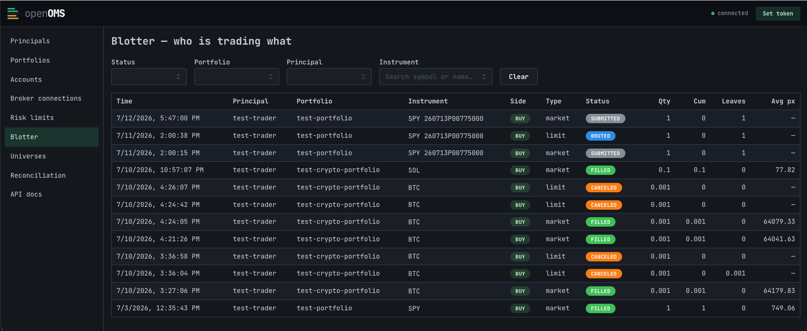
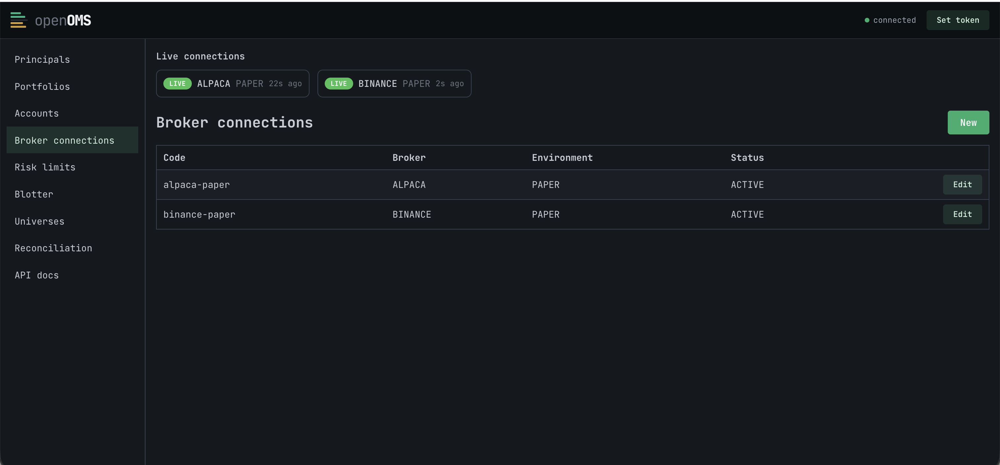

# OpenOMS


<p align="center">
  
</p>
<p align="center">
  <a href="https://github.com/maxkuttner/openoms/actions/workflows/build.yml">
    
  </a>
</p>

*An* open source multi-client order management system.




## Install

Prerequisites: **Rust** (cargo), **PostgreSQL**. Optional: **Python 3** (live universe seeders), **Node** (cockpit).

```sh
git clone git@github.com:maxkuttner/openoms.git && cd openoms
cp .env.example .env        # then edit passwords / bind addr
```

## Run

With the `ADMIN_*` superuser + role passwords set in `.env`, just start the app — it
self-provisions on boot (roles, schema, reference data) and, if broker creds are
present, syncs that broker's instrument catalog in the background. No ordered setup
commands.

```sh
cargo run                  # OMS on OMS_BIND_ADDR (default localhost:3001)
```

First boot on an empty database runs provision → migrate → seed before listening (a
few seconds), then the server binds immediately while instruments populate in the
background. Subsequent boots are near-instant no-ops. Set `OMS_SYNC_ON_BOOT=never` to
skip auto-sync, or `OMS_BOOTSTRAP=off` when infrastructure is provisioned elsewhere.

The SPY fixture seeds `alpaca-paper` + a test user (`test-trader-key` : `test-secret`),
so you can place a paper order immediately. Admin webapp: `cd cockpit && npm install && npm run dev`.

### Manual setup (optional)

The bootstrap just orchestrates the same idempotent make targets, if you'd rather run
them yourself (or set `OMS_BOOTSTRAP=off`):

```sh
make db-setup                                 # roles, schema, ref-data, SPY fixture
make sync-broker BROKER=alpaca               # instruments + broker mapping from Alpaca
make sync-broker BROKER=alpaca UNDERLYINGS=SPY,QQQ  # also seed those option chains
```
