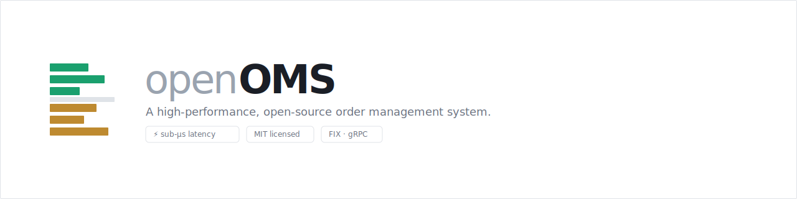

<!-- 

  <picture>
    <source media="(prefers-color-scheme: dark)" srcset="assets/openoms-banner-dark.svg">
    
  </picture>

-->
**TODO:**

**★ #1 — Central instrument symbology (consolidate the mapping)**
- [x] **`crates/symbology`** — a standalone, exposable Rust library that identifies an instrument
      record (ticker+exchange / ISIN / CUSIP / FIGI) to a canonical **FIGI** identity via OpenFIGI
      (pure resolver + swappable `FigiProvider` + cache; `cargo run -p symbology --example identify
      -- AAPL US` → `BBG000B9XRY4`). The engine's brain.
- [ ] **wire it into the OMS** as the single resolution path, replacing today's fragmented logic
      (`seed_instruments.py` venue-aware, `broker_sync.py` symbol-only, Rust routing/recon query
      `broker_instrument` directly — inconsistent, and the symbol-only path collapses multi-venue
      symbols):
      - add `figi`/`cusip` to the master `instrument`; a thin resolver feeds each external record
        (Databento def / Alpaca asset / custodian holding) through `symbology::identify`
      - backed by a unified **`instrument_xref`** (generalising `provider_instrument` +
        `broker_instrument`); one writer, one place to audit unresolved/ambiguous securities, so
        new sources (3rd-party custodians) plug in without another bespoke matcher

**Instrument Seeding**
- [ ] cache Databento `definition` fetches to `.dbn` so resets replay offline (no refetch)
- [ ] `EQUS_SUMMARY` is consolidated like the removed `DBEQ.BASIC` — same symbol-spans-venues collision risk if enabled

## Cockpit (admin webapp)

`cockpit/` — a React/TS SPA over the admin API to set up principals (+ keys + grants),
portfolios, accounts, broker connections, and risk limits, and to watch the order **blotter**.
Dev: start the OMS, then `cd cockpit && npm install && npm run dev` (Vite proxies `/api` → the
OMS). See `cockpit/README.md`. Backend: risk limits are now CRUD-able at `/admin/risk-limits`.

## Roadmap — REST OMS now → low-latency execution engine

Vision: ship a correct REST OMS (**system of record + governance + oversight**), then evolve the
same Rust, event-sourced core into a **low-latency, execution-capable** system — to serve
systematic / quant funds (QRT-scale and smaller), not just discretionary buy-side. Latency
ladder: **ms (REST) → sub-ms (in-memory + FIX) → μs (lock-free / colo)**. Feature benchmark in
`docs/oems-feature-gap.md`.

The reusable asset across every phase is the **domain core** (event-sourced order aggregate,
lifecycle, risk, positions). Phases rebuild the I/O + persistence layers, not the brain.

### Phase 1 — OMS core (REST · system of record + governance)

Done: event-sourced order SoR + audit log · entitlements (principal × portfolio grants) ·
pre-trade risk + trading-state HALT · positions + P&L · multi-broker routing · post-trade
allocation. (A client needs only a **principal + portfolio** to trade; account is custodial-only
and inferred from the portfolio's default route. No-creds fixture seeds `alpaca-paper` + a test
user `test-trader-key` : `test-secret`.)
- [x] **cancel — broker-confirmed** — `POST /orders/cancel` requests the cancel at the broker
      (202); the execution stream finalizes `OrderCanceled` on confirmation (fixes the fill-vs-
      cancel race); `external_order_id` now stored on `order_state`
- [x] **blotter / oversight query API** — `GET /admin/orders`: all orders across principals/
      portfolios with `principal_id` on the order, filterable (status/portfolio/instrument/
      principal/connection/side/time) + paginated ("who is trading what"). Fills/positions
      oversight views are quick follow-ons
- [x] **custodian reconciliation (read & compare)** — `POST /admin/recon/run` fetches a
      custodian's holdings (Alpaca paper = broker+custodian) and diffs them against our positions,
      per broker connection; breaks (qty mismatch / missing either side / unresolved security)
      are stored + shown in the cockpit. Symbology resolves via `broker_instrument`
      - [ ] _future: central cross-reference (`instrument_xref` + ISIN/CUSIP/FIGI on the master)
            for real 3rd-party custodians that report by ISIN/CUSIP; the OMS reconciles, it does
            **not** instruct settlement (that's the custodian + market infra's job)_

### Phase 2 — oversight & control depth (REST)

- [ ] **central kill-switch / trading-halt** — HALT a portfolio / instrument / principal on demand
- [ ] **amend/replace** — wire `ReplaceOrder` API→broker→event (Alpaca replace = cancel + new
      order); nice-to-have, the cancel groundwork (`external_order_id`, `ExecutionReport`) carries over
- [ ] **drop-copy / external-execution ingestion** — report orders + fills executed *elsewhere*
      into the OMS, so it has central oversight even off the execution path (the quant bridge)
- [ ] **light mandate compliance** — restricted/blocked lists; concentration / leverage (w/ marks)
- [ ] **finer entitlements & risk** — per-instrument / per-strategy limits
- [ ] **market data / P&L marks** — unrealized P&L, exposure valuation
- [ ] optional **maker-checker approval** — configurable, not a mandatory gate

### Phase 3 — execution capability + latency foundation (the pivot)

- [ ] **decouple the hot path from Postgres** — in-memory authoritative order/risk/position state
      + **async event journal**; Postgres becomes a downstream projection (event-sourcing done
      right; ms → sub-ms; prerequisite for everything below)
- [ ] **FIX / binary order entry** (persistent sessions) alongside REST
- [ ] **direct venue connectivity** (exchange gateways) + **L2 market data** (order books)
- [ ] **SOR + execution algos** (TWAP / VWAP / POV) + order slicing; per-connection execution
      streams; crossing (internal netting)

### Phase 4 — low-latency hardening (mid → high frequency)

- [ ] thread-per-core / lock-free / no-allocation hot path, pinned threads, busy-poll
- [ ] binary wire protocol (e.g. SBE), kernel-bypass networking
- [ ] colocation; in-line μs pre-trade risk

### Discretionary add-ons (as needed)

- [ ] pre-trade **baskets** + bulking; across-accounts allocation grain; best-execution logging

### Out of scope

Settlement-instruction generation + venue-level regulatory reporting (broker/custodian's job);
full portfolio analytics (rebalancing, index/model tracking, NAV / what-if, OTC RFQ).
